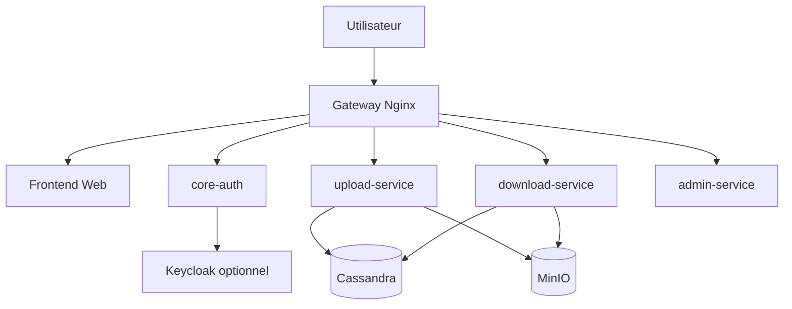
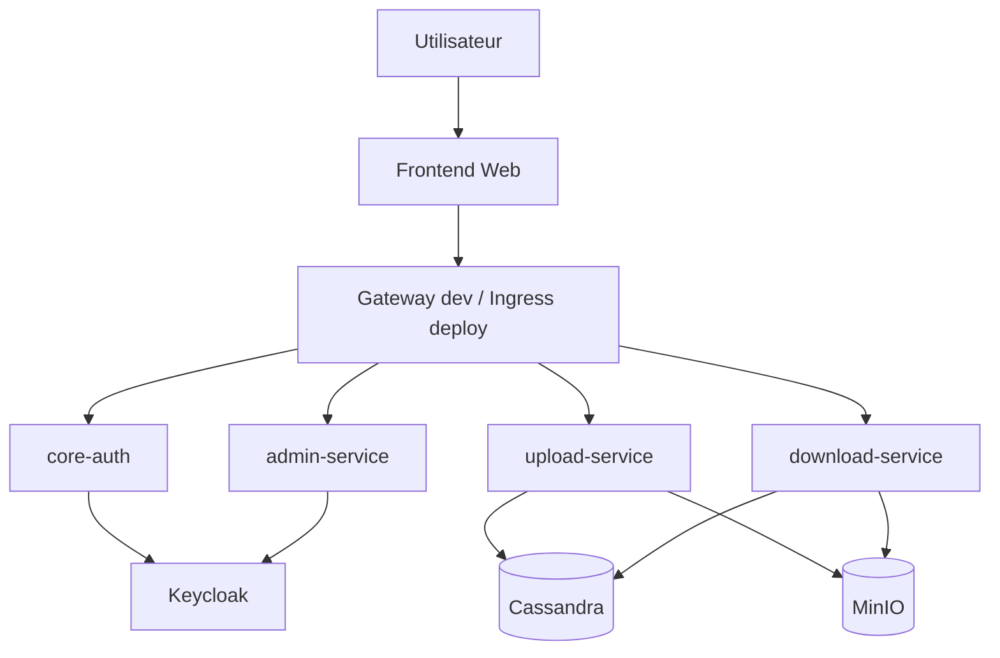

# DAT V2 - Dossier d'Architecture Technique

## 1. Objet du document

Ce document decrit:

- l'architecture cible du projet ENT
- l'etat reel de l'implementation dans ce depot

Il faut donc distinguer:

- ce qui est deja code
- ce qui reste une cible d'architecture

## 2. Perimetre stable du projet

### Microservices applicatifs obligatoires

| Service | Role |
|---|---|
| `core-auth` | Authentification et validation des tokens |
| `upload-service` | Upload des ressources pedagogiques |
| `download-service` | Consultation et telechargement |
| `admin-service` | Administration des utilisateurs et des roles |

### Composants de support

| Composant | Role |
|---|---|
| `frontend-web` | Interface React |
| `keycloak` | IAM et emission de tokens |
| `cassandra` | Stockage des metadonnees |
| `minio` | Stockage objet des fichiers |
| `gateway` | Point d'entree dev, cible future |
| `ingress` | Point d'entree deploy, cible future |
| `ollama` | Extension IA optionnelle |

## 3. Etat reel du depot aujourd'hui

Le depot contient actuellement:

- les 4 microservices backend
- le frontend React
- un `docker-compose.yml`
- un gateway Nginx de dev
- une integration Keycloak pour l'authentification
- Cassandra et MinIO dans la stack locale

Le depot ne contient pas encore:

- des manifests Kubernetes reels
- un modele metier complet centre sur les cours

## 4. Vue d'ensemble

### Architecture actuellement implementee



### Architecture cible



## 5. Description des composants

### 5.1 `frontend-web`

Etat actuel:

- interface React existante
- login, upload, consultation, administration
- flux normal via gateway
- ports directs `localhost:8001` a `localhost:8004` gardes pour debug

Cible:

- appels via gateway en dev
- appels via Ingress en deploy

### 5.2 `core-auth`

Etat actuel:

- expose login, validation token, profil, roles
- flow Keycloak-first
- validation JWT Keycloak

Cible:

- documentation centree sur JWT Keycloak

### 5.3 `upload-service`

Etat actuel:

- upload de fichier
- verification du role `teacher`
- stockage MinIO
- metadonnees minimales dans Cassandra

Important:

- le service manipule surtout des fichiers
- il n'implemente pas encore un vrai modele `course`

### 5.4 `download-service`

Etat actuel:

- liste des fichiers
- lecture d'un fichier
- generation d'URL pre-signee MinIO

Important:

- l'API actuelle est `files`-centric, pas `courses`-centric

### 5.5 `admin-service`

Etat actuel:

- CRUD utilisateurs via Keycloak Admin API
- verification du role admin
- gestion reelle des roles Keycloak

### 5.6 `keycloak`

Etat actuel:

- present dans Docker Compose
- realm export fourni

Important:

- le frontend utilise un parcours Keycloak-first avec redirection et callback

### 5.7 `cassandra`

Etat actuel:

- keyspace `ent`
- table pratique `course_files`

### 5.8 `minio`

Etat actuel:

- utilise pour stocker les objets uploades
- console exposee

### 5.9 `ollama`

Etat actuel:

- non implemente dans ce depot

Statut:

- bonus futur uniquement

## 6. Flux fonctionnels

### 6.1 Authentification - etat actuel

```text
1. L'utilisateur ouvre le frontend via le gateway
2. Le frontend demande l'URL de connexion a core-auth
3. L'utilisateur est redirige vers Keycloak
4. Keycloak renvoie un code OAuth2
5. core-auth echange ce code contre un token
6. Le frontend stocke le token
7. Les autres services verifient le token Keycloak
```

### 6.2 Authentification - cible

```text
1. L'utilisateur ouvre le frontend
2. Le frontend redirige vers Keycloak
3. Keycloak retourne un JWT
4. Le frontend transmet le JWT aux APIs
5. Les services valident le token et les roles
```

### 6.3 Upload - etat actuel

```text
1. L'enseignant se connecte
2. Il choisit un nom de cours simple et un fichier
3. Le frontend appelle upload-service via le gateway
4. upload-service verifie le role teacher
5. Le fichier est stocke dans MinIO
6. Les metadonnees fichier sont enregistrees dans Cassandra
```

### 6.4 Consultation / telechargement - etat actuel

```text
1. L'etudiant se connecte
2. Le frontend interroge download-service via le gateway
3. download-service lit les fichiers dans Cassandra
4. download-service genere un lien pre-signe MinIO
5. L'etudiant telecharge le fichier
```

### 6.5 Administration - etat actuel

```text
1. L'admin se connecte
2. Le frontend appelle admin-service via le gateway
3. admin-service appelle l'API Admin de Keycloak
4. Les changements sont appliques dans le realm Keycloak
```

## 7. Schema de donnees

### 7.1 Schema actuel

Table actuellement creee par le depot:

| Champ | Type | Description |
|---|---|---|
| `id` | UUID | Identifiant fichier |
| `filename` | TEXT | Nom du fichier |
| `course_name` | TEXT | Libelle simple du cours |
| `uploaded_by` | TEXT | Auteur de l'upload |
| `upload_date` | TIMESTAMP | Date d'upload |
| `minio_path` | TEXT | Chemin objet MinIO |

### 7.2 Schema cible

Le modele peut ensuite evoluer vers:

- `courses`
- `course_files`
- `audit_logs`

Mais ce schema cible n'est pas encore implemente dans le depot.

## 8. APIs

### 8.1 APIs actuellement implementees

#### `core-auth`

- `POST /api/auth/token/validate`
- `GET /api/auth/me`
- `GET /api/auth/roles`
- `GET /api/auth/login/keycloak`
- `GET /api/auth/callback`
- `GET /api/auth/logout/keycloak`

#### `upload-service`

- `POST /api/upload/upload`

#### `download-service`

- `GET /api/download/files`
- `GET /api/download/files/{file_id}`
- `GET /api/download/files/{file_id}/download`

#### `admin-service`

- `GET /api/admin/users`
- `POST /api/admin/users`
- `GET /api/admin/users/{user_id}`
- `PATCH /api/admin/users/{user_id}/roles`
- `DELETE /api/admin/users/{user_id}`
- `GET /api/admin/roles`

### 8.2 APIs cibles

Une version plus riche pourra viser:

- `POST /api/upload/courses`
- `POST /api/upload/courses/{course_id}/files`
- `GET /api/download/courses`
- `GET /api/download/courses/{course_id}`
- `GET /api/download/files/{file_id}/download`

## 9. Securite

### Controles deja visibles

- verification de token Keycloak sur les endpoints proteges
- autorisation par role sur upload et admin
- telechargement via URL pre-signee MinIO

### Controles encore incomplets

- HTTPS / Ingress en deploiement
- gestion plus robuste des secrets

## 10. Docker

### Conteneurs actuellement presents dans Compose

| Conteneur | Statut |
|---|---|
| `gateway` | implemente |
| `frontend` | implemente |
| `core-auth` | implemente |
| `upload-service` | implemente |
| `download-service` | implemente |
| `admin-service` | implemente |
| `keycloak` | implemente |
| `cassandra` | implemente |
| `cassandra-init` | implemente |
| `minio` | implemente |

### Conteneurs cibles non encore presents

| Conteneur | Statut |
|---|---|
| `ollama` | non implemente |

## 11. Environnements

### 11.1 Developpement local - etat reel

- application principale via `http://localhost`
- frontend debug sur `http://localhost:5173`
- services backend sur `8001` a `8004`
- Keycloak sur `8080`
- MinIO console sur `9001`

### 11.2 Deploiement - cible

- images Docker versionnees
- Kubernetes
- Ingress
- ConfigMaps et Secrets

## 12. Kubernetes

Kubernetes reste une cible du projet, mais pas encore une partie implementee du depot.

Le dossier `k8s/` existe aujourd'hui comme placeholder.

## 13. Conclusion

Le projet est coherent avec le sujet sur les points essentiels:

- 4 microservices imposes presents
- stack technologique globalement conforme
- Docker Compose deja utilise
- Keycloak, Cassandra et MinIO deja integres au socle

Mais il faut presenter honnetement que le depot est encore un MVP en evolution, avec plusieurs ecarts entre l'architecture cible et l'implementation actuelle.
