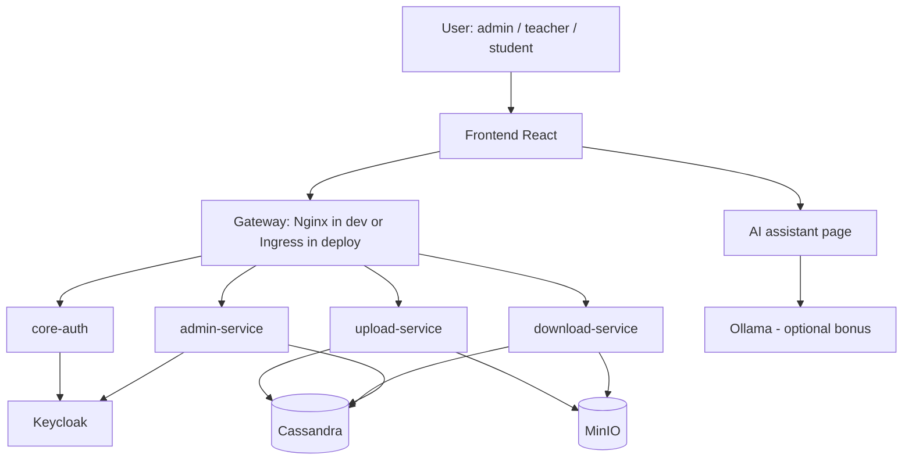

# ENT EST Sale - V3 Reviewed

## 1. Purpose of this document

This reviewed version keeps the good DevOps ideas from `ENT_PROPOSAL_V3.md`, but makes the whole proposal coherent with the real project brief.

This document is now aligned with:

- the **4 required microservices**
- the **ENT use case**
- **FastAPI + React**
- **Keycloak + JWT**
- **Cassandra + MinIO**
- **Docker for local development**
- **Kubernetes for deployment**
- **Ubuntu 24.10 on VMware ESXi**
- **Ollama / Llama 3** as the AI extension

## 2. Project context

The project is not a generic microservices demo. It is an **ENT for EST Sale**.

The minimum required business scope is:

- authentication of users
- upload of course content by teachers
- listing and secure download by students
- administration of users and roles

The professor's mandatory application microservices are:

1. `core-auth`
2. `upload-service`
3. `download-service`
4. `admin-service`

Everything else is a support component, not one of the 4 required microservices.

## 3. Coherent target architecture

### 3.1 Required application microservices

#### `core-auth`

Responsibilities:

- integrate with Keycloak
- validate JWT tokens
- expose user identity and role information

#### `upload-service`

Responsibilities:

- allow teachers to create or enrich course resources
- upload files to MinIO
- store metadata in Cassandra
- enforce the `teacher` role

#### `download-service`

Responsibilities:

- list available courses and files
- read metadata from Cassandra
- generate secure download links from MinIO
- enforce student access rules

#### `admin-service`

Responsibilities:

- create users
- assign roles
- manage basic administration tasks

### 3.2 Support components

These are necessary, but they are not counted as the 4 mandatory microservices:

- `frontend-web`
- `gateway` in dev mode
- `ingress` in deployment mode
- `keycloak`
- `cassandra`
- `minio`
- `ollama` as AI extension

## 4. Logical architecture



## 5. Why this architecture is coherent

This version is coherent because:

- the 4 required microservices are kept exactly as requested
- the ENT domain is explicit
- Docker is used for **local development**
- Kubernetes is used for **deployment**
- Nginx gateway is used in dev as a single entry point
- Ingress replaces the local gateway pattern in deployment
- Ollama is treated as an extension, not a replacement for the required scope

## 6. Mono-repo structure

For your team of 5, a mono-repo is the best choice.

```text
project-ent/
|
|-- .github/
|   `-- workflows/
|       |-- ci.yml
|       `-- deploy.yml
|
|-- docker-compose.yml
|-- .env.example
|-- README.md
|
|-- frontend/
|   |-- Dockerfile
|   |-- package.json
|   `-- src/
|
|-- backend/
|   |-- core-auth/
|   |   |-- Dockerfile
|   |   |-- requirements.txt
|   |   |-- main.py
|   |   `-- app/
|   |
|   |-- upload-service/
|   |   |-- Dockerfile
|   |   |-- requirements.txt
|   |   |-- main.py
|   |   `-- app/
|   |
|   |-- download-service/
|   |   |-- Dockerfile
|   |   |-- requirements.txt
|   |   |-- main.py
|   |   `-- app/
|   |
|   `-- admin-service/
|       |-- Dockerfile
|       |-- requirements.txt
|       |-- main.py
|       `-- app/
|
|-- nginx/
|   `-- nginx.conf
|
|-- keycloak/
|   `-- realm-export.json
|
|-- cassandra/
|   `-- init.cql
|
|-- minio/
|   `-- init.sh
|
`-- k8s/
    |-- base/
    `-- overlays/
```

## 7. Dev mode vs deploy mode

This distinction is essential.

### 7.1 Dev mode

Goal:

- code faster
- debug easily
- run everything locally

Tools:

- Docker Compose
- mounted volumes
- FastAPI with reload
- React dev server
- debug ports exposed when useful

### 7.2 Deploy mode

Goal:

- run a stable shared version
- demonstrate cloud and orchestration
- secure and supervise the system

Tools:

- Docker images
- Kubernetes
- ConfigMaps and Secrets
- Ingress
- persistent volumes

### 7.3 Important clarification

Docker Compose and Kubernetes are **not identical**.

They share some ideas:

- containers
- networking
- environment variables
- restart logic

But Kubernetes is a more advanced orchestration platform and must be treated as the deployment target, not just "Compose in another form".

## 8. Local development with Docker Compose

### 8.1 Recommended local components

In local development, Docker Compose should run:

- `frontend`
- `gateway`
- `core-auth`
- `upload-service`
- `download-service`
- `admin-service`
- `keycloak`
- `cassandra`
- `minio`

Optional:

- `ollama`

So the local stack is **9 components**, or **10 if Ollama is included**.

### 8.2 Recommended `.env.example`

```env
# General
APP_ENV=development

# Cassandra
CASSANDRA_HOST=cassandra
CASSANDRA_PORT=9042
CASSANDRA_KEYSPACE=ent

# Keycloak
KEYCLOAK_URL=http://keycloak:8080
KEYCLOAK_REALM=ent-est-sale
KEYCLOAK_CLIENT_ID=ent-backend
KEYCLOAK_CLIENT_SECRET=change-me

# MinIO
MINIO_URL=http://minio:9000
MINIO_ACCESS_KEY=minioadmin
MINIO_SECRET_KEY=change-me
MINIO_BUCKET=course-files

# AI
OLLAMA_URL=http://ollama:11434
OLLAMA_MODEL=llama3
```

### 8.3 Gateway rule in dev mode

The normal browser path should be:

- `http://localhost` -> frontend through gateway
- `http://localhost/api/auth/...`
- `http://localhost/api/upload/...`
- `http://localhost/api/download/...`
- `http://localhost/api/admin/...`

Direct ports like `8001`, `8002`, `8003`, `8004`, or `3000` can still be exposed in dev mode, but only for:

- Swagger debugging
- direct service testing
- troubleshooting

So the coherent rule is:

- **normal user flow through gateway**
- **direct service ports for developers only**

## 9. Recommended route naming

The original V3 used generic paths like `/api/service1/`. That is not coherent for your project.

Use project-specific paths:

```text
/api/auth/
/api/upload/
/api/download/
/api/admin/
```

This makes the platform easier to understand during development and presentation.

## 10. Recommended Nginx gateway behavior in dev

```nginx
events {
  worker_connections 1024;
}

http {
  upstream frontend_app { server frontend:3000; }
  upstream auth_api     { server core-auth:8000; }
  upstream upload_api   { server upload-service:8000; }
  upstream download_api { server download-service:8000; }
  upstream admin_api    { server admin-service:8000; }

  server {
    listen 80;

    location / {
      proxy_pass http://frontend_app;
      proxy_set_header Host $host;
      proxy_set_header Upgrade $http_upgrade;
      proxy_set_header Connection "upgrade";
    }

    location /api/auth/ {
      proxy_pass http://auth_api/;
      proxy_set_header Host $host;
      proxy_set_header Authorization $http_authorization;
    }

    location /api/upload/ {
      proxy_pass http://upload_api/;
      proxy_set_header Host $host;
      proxy_set_header Authorization $http_authorization;
    }

    location /api/download/ {
      proxy_pass http://download_api/;
      proxy_set_header Host $host;
      proxy_set_header Authorization $http_authorization;
    }

    location /api/admin/ {
      proxy_pass http://admin_api/;
      proxy_set_header Host $host;
      proxy_set_header Authorization $http_authorization;
    }
  }
}
```

## 11. Authentication approach

### 11.1 Coherent auth flow

1. user opens the frontend
2. frontend redirects to Keycloak
3. user logs in
4. Keycloak returns a JWT
5. frontend sends the JWT in API requests
6. backend services validate the token
7. access is granted or denied based on the user role

### 11.2 Important correction to the original V3

The original file mixed:

- validation with Keycloak public key
- validation through the introspection endpoint

For coherence, your proposal should choose one main approach.

### 11.3 Recommended project choice

For your team project, keep the explanation simple:

- services validate JWTs using Keycloak realm configuration
- roles such as `admin`, `teacher`, and `student` are extracted from the token

If your implementation uses introspection in some services, mention it as an implementation detail, not as the main architectural explanation.

## 12. Service responsibilities and dependencies

| Service | Main role | Depends on |
|---|---|---|
| `core-auth` | auth validation and profile info | Keycloak |
| `upload-service` | upload and metadata write | Keycloak, Cassandra, MinIO |
| `download-service` | list and secure download | Keycloak, Cassandra, MinIO |
| `admin-service` | user and role administration | Keycloak, optionally Cassandra |

## 13. Data and storage model

### Cassandra

Use Cassandra for:

- course metadata
- file metadata
- optional audit traces

Example logical entities:

- `courses`
- `course_files`
- `audit_logs`

### MinIO

Use MinIO for:

- PDFs
- TDs
- TPs
- corrections
- any binary educational file

### Keycloak

Use Keycloak for:

- identities
- roles
- access control

## 14. Git and team workflow

Your team is:

- `3 dev`
- `2 IT`
- one of the IT members is also the `PM`

### Recommended branch model

```text
main
develop
feature/core-auth
feature/upload-service
feature/download-service
feature/admin-service
feature/frontend
feature/devops-compose
feature/k8s-manifests
```

### Recommended coordination rule

- nobody pushes directly to `main`
- feature branches merge into `develop`
- `main` is reserved for validated milestones
- the PM tracks progress and integration readiness

## 15. CI/CD

### Minimum CI pipeline

On pull requests:

- run backend tests
- run frontend lint
- verify Docker image builds

On merge to `main`:

- build versioned Docker images
- push to registry
- prepare Kubernetes deployment

### Why this is coherent for the project

Because it supports both:

- local team productivity
- final deployment on the private cloud environment

## 16. Deployment architecture

The original V3 mixed Kubernetes production and single-VM Compose production. For your project, the final target should clearly be Kubernetes on VMware-hosted Ubuntu VMs.

### Recommended infrastructure layout

```text
VMware ESXi private cloud
|
|-- VM1 - Ubuntu 24.10 - Kubernetes control plane
|-- VM2 - Ubuntu 24.10 - worker node
|-- VM3 - Ubuntu 24.10 - worker node
`-- VM4 - Ubuntu 24.10 - data and identity services
```

### Suggested placement

- `frontend-web`, `core-auth`, `upload-service` on worker nodes
- `download-service`, `admin-service` on worker nodes
- `keycloak`, `cassandra`, `minio` on the data VM or via dedicated storage strategy
- `ollama` on the strongest machine if resources allow it

## 17. Kubernetes role

Kubernetes should be responsible for:

- deploying containers
- restarting failed pods
- exposing services through Ingress
- managing configuration and secrets
- supporting future scaling

### Expected Kubernetes objects

- `Deployment`
- `Service`
- `ConfigMap`
- `Secret`
- `Ingress`
- `PersistentVolumeClaim`

## 18. AI integration with Ollama

The original V3 barely covered the AI requirement. This reviewed version makes it explicit.

### Recommended position of AI in the project

Ollama is a **bonus extension**, added after the 4 required microservices are stable.

### Recommended use cases

- summarize a course document
- answer questions about uploaded course material
- help students find relevant resources

### Recommended caution

Do not let the AI part destabilize the core ENT.

Project order should be:

1. auth
2. upload
3. download
4. admin
5. frontend integration
6. Docker and Kubernetes
7. Ollama bonus

## 19. Access points by environment

### Dev mode

| Endpoint | Purpose |
|---|---|
| `http://localhost` | main application through gateway |
| `http://localhost:8080` | Keycloak |
| `http://localhost:9001` | MinIO console |
| `http://localhost:8001/docs` | debug docs for `core-auth` |
| `http://localhost:8002/docs` | debug docs for `upload-service` |
| `http://localhost:8003/docs` | debug docs for `download-service` |
| `http://localhost:8004/docs` | debug docs for `admin-service` |

### Deploy mode

| Endpoint | Purpose |
|---|---|
| `https://ent.your-domain` | frontend and main entry |
| `https://ent.your-domain/api/...` | backend through Ingress |
| `https://auth.your-domain` | Keycloak |

## 20. Risks and realistic simplifications

### Main risks

- Cassandra can be heavy for a student project
- Keycloak setup can consume time
- Kubernetes can slow the team if started too early
- Ollama may require strong hardware

### Smart simplifications

- keep Cassandra schema minimal
- start with local Docker Compose before Kubernetes
- keep Keycloak local setup simple in dev mode
- make Ollama optional in the first successful milestone

## 21. Final coherence verdict

This reviewed architecture is coherent because it now matches:

- the professor's required 4 microservices
- the ENT domain
- the team size and workflow
- the Docker local dev story
- the Kubernetes deployment story
- the private cloud target
- the AI bonus requirement

## 22. Final recommendation

If you use this document as your reference, the clean message for the professor is:

- we develop locally with Docker Compose
- we keep the 4 required microservices clearly separated
- we deploy on Ubuntu 24.10 VMs hosted on VMware ESXi
- we use Kubernetes for orchestration
- we add Ollama as a controlled bonus after the core ENT is stable
