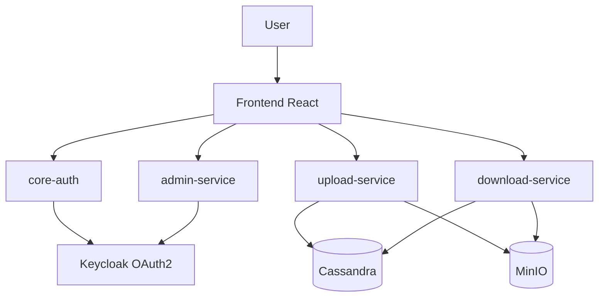

# ENT EST Sale - Proposal

## 1. Purpose

This document presents the intended target architecture of the ENT EST Sale project.

It reflects the official technical direction of the project, while keeping the implementation progressive and realistic.

## 2. Technologies Used

- Backend: Python with FastAPI
- Frontend: React
- Database: Cassandra
- File storage: MinIO
- Authentication: OAuth2 with Keycloak
- Deployment target: Ubuntu on VMware virtual machines
- Communication: REST APIs
- Containerization and orchestration for local stack: Docker + Docker Compose
- AI extension: Ollama with Llama 3

## 3. Project Objective

The project is an ENT platform for EST Sale.

The core functional scope is:

- authentication of users
- upload of course content by teachers
- listing and download of course content by students
- administration of users and roles

The AI part is kept separate from the core platform and will be treated only after the main ENT features are stable.

## 4. Required Application Microservices

The mandatory backend microservices are:

1. `core-auth`
2. `upload-service`
3. `download-service`
4. `admin-service`

Everything else is considered a support or platform component.

## 5. Support Components

- `frontend-web`
- `keycloak`
- `cassandra`
- `minio`
- `docker-compose` local stack
- `vmware/ubuntu` deployment environment
- `ollama` as a later bonus task

## 6. Microservice Architecture

### Data and storage

- Cassandra stores course information, metadata, sessions, and related structured data
- MinIO stores files associated with courses
- Keycloak provides OAuth2 authentication and role-based access control

### Main responsibilities

#### `core-auth`

- manage authentication integration with Keycloak
- validate tokens
- expose current user identity and roles

#### `upload-service`

- allow a teacher to add a course
- receive course metadata and associated files
- store metadata in Cassandra
- store files in MinIO

#### `download-service`

- expose the list of available courses
- allow students to consult course information
- allow download of files associated with courses

#### `admin-service`

- manage users
- manage roles
- support administration of the platform
- execute user and role operations against Keycloak

## 7. Global Architecture

## 8. Workflow

### Teacher workflow

1. A teacher authenticates through the platform
2. The teacher adds a course using the API
3. The request contains title, description, and associated files
4. Course data and metadata are stored in Cassandra
5. Files are stored in MinIO

### Student workflow

1. A student authenticates through the platform
2. The student retrieves the list of available courses
3. The student consults course information
4. The student downloads the associated files

## 9. AI Extension

The chatbot based on Ollama and Llama 3 is part of the project vision, but it is not part of the first core milestone.

Its future role will be:

- answer student questions
- provide information about course content
- act as a separate AI assistant feature

Important project rule:

- Ollama must remain the last separate task of the project
- the team should return to it only after the core ENT platform is stable

## 10. Project Execution Order

The recommended execution order is:

1. local development stack with Docker Compose
2. `core-auth`
3. `upload-service`
4. `download-service`
5. `admin-service`
6. frontend integration
7. stabilization and testing
8. deployment preparation on Ubuntu VMs
9. Ollama / Llama 3 as the last separate task

## 11. Deployment Vision

The deployment target is:

- Ubuntu virtual machines
- hosted on VMware
- application components exposed through REST APIs
- containerized with Docker and coordinated through Docker Compose for the local stack

## 12. Final Position

This proposal keeps the project coherent around:

- FastAPI microservices
- React frontend
- Cassandra for structured metadata
- MinIO for course files
- Keycloak OAuth2 authentication
- Docker and Docker Compose for the platform setup
- Ubuntu on VMware as deployment target

And it clearly separates the AI component:

- Ollama with Llama 3 is intentionally postponed to the final separate phase of the project
